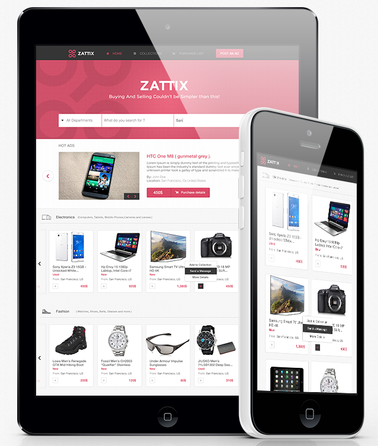

# Capstone - HTML/CSS - Fruit Bazaar

> In this project, I got the chance to build a responsive website of a Fruit Bazaar. I’ll be using Mohammad Awad layoust from this incredibly work he did and post in [Bëhance](https://www.behance.net/gallery/24796463/ZATTIX), with some changes, this page I planned to use it for learning porpusess for mastering SASS pre-compailer. Here I'll add a shot of the main content;

## Built With

- HTML5/CSS3
- SASS Precompailer
- Visual Studio Code
- Nu HTML Validator
- Beautify
- Font Awesome
- Google Font

## Live Demo

[Live Demo Link](https://rawcdn.githack.com/Dandush03/Fruit-Bazaar/19f5e2f69bf9ce6a2af24f303bd30384a4333ee9/index.html)

## Getting Started

**The webpage is a Capstone Project of Microverse. None of the elements in it really work. It is only to showcase our HTML, CSS and SASS coding abilities.**

## Author

**Danie Laloush**
- Linkedin: [Daniel Laloush](https://www.linkedin.com/in/daniel-laloush-0a7331a9)
- Github: [@Dandush03](https://github.com/Dandush03)
- Twitter: [@d_laloush](https://twitter.com/d_laloush)

## 🤝 Contributing

Contributions, issues and feature requests are welcome!

Feel free to check the [issues page](./issues/).

## Show your support

Give a ⭐️ if you like this project!

## Acknowledgments

- Hat tip to anyone whose code was used
- Thanks to Microverse!
- Thanks to Mohammed Awad for his Awesome Design
- And Last But Not Least, Thanks for Amazon for Providing the Content Needed

## 📝 License

This project is [MIT](lic.url) licensed.
